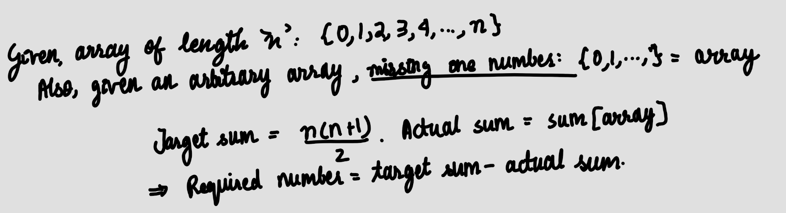

<h2><a href="https://leetcode.com/problems/missing-number">Missing Number</a></h2> <hr><p>Given an array <code>nums</code> containing <code>n</code> distinct numbers in the range <code>[0, n]</code>, return <em>the only number in the range that is missing from the array.</em></p>

<p>&nbsp;</p>
<p><strong class="example">Example 1:</strong></p>

<div class="example-block">
<p><strong>Input:</strong> <span class="example-io">nums = [3,0,1]</span></p>

<p><strong>Output:</strong> <span class="example-io">2</span></p>

<p><strong>Explanation:</strong></p>

<p><code>n = 3</code> since there are 3 numbers, so all numbers are in the range <code>[0,3]</code>. 2 is the missing number in the range since it does not appear in <code>nums</code>.</p>
</div>

<p><strong class="example">Example 2:</strong></p>

<div class="example-block">
<p><strong>Input:</strong> <span class="example-io">nums = [0,1]</span></p>

<p><strong>Output:</strong> <span class="example-io">2</span></p>

<p><strong>Explanation:</strong></p>

<p><code>n = 2</code> since there are 2 numbers, so all numbers are in the range <code>[0,2]</code>. 2 is the missing number in the range since it does not appear in <code>nums</code>.</p>
</div>

<p><strong class="example">Example 3:</strong></p>

<div class="example-block">
<p><strong>Input:</strong> <span class="example-io">nums = [9,6,4,2,3,5,7,0,1]</span></p>

<p><strong>Output:</strong> <span class="example-io">8</span></p>

<p><strong>Explanation:</strong></p>

<p><code>n = 9</code> since there are 9 numbers, so all numbers are in the range <code>[0,9]</code>. 8 is the missing number in the range since it does not appear in <code>nums</code>.</p>
</div>

<div class="simple-translate-system-theme" id="simple-translate">
<div>
<div class="simple-translate-button isShow" style="background-image: url(&quot;moz-extension://8a9ffb6b-7e69-4e93-aae1-436a1448eff6/icons/512.png&quot;); height: 22px; width: 22px; top: 318px; left: 36px;">&nbsp;</div>

<div class="simple-translate-panel " style="width: 300px; height: 200px; top: 0px; left: 0px; font-size: 13px;">
<div class="simple-translate-result-wrapper" style="overflow: hidden;">
<div class="simple-translate-move" draggable="true">&nbsp;</div>

<div class="simple-translate-result-contents">
<p class="simple-translate-result" dir="auto">&nbsp;</p>

<p class="simple-translate-candidate" dir="auto">&nbsp;</p>
</div>
</div>
</div>
</div>
</div>

<p>&nbsp;</p>
<p><strong>Constraints:</strong></p>

<ul>
	<li><code>n == nums.length</code></li>
	<li><code>1 &lt;= n &lt;= 10<sup>4</sup></code></li>
	<li><code>0 &lt;= nums[i] &lt;= n</code></li>
	<li>All the numbers of <code>nums</code> are <strong>unique</strong>.</li>
</ul>

<p>&nbsp;</p>
<p><strong>Follow up:</strong> Could you implement a solution using only <code>O(1)</code> extra space complexity and <code>O(n)</code> runtime complexity?</p>

## Thought Process

- What was my initial understanding?
- What approach did I first consider and why?
- What confused me at first?

---

## Approaches

---

### Approach 1: Brute Force

#### Data Structures Used
Array

#### Algorithm
I started out with the brute force approach initially - create an array of integers from 0 to n, loop through the ```nums``` array to check if any value is missing, then return the value that is missing.

#### Complexity Analysis
- Time Complexity: O(n^2)
- Space Complexity: O(n)

#### Code
```python
class Solution(object):
    def missingNumber(self, nums):
        """
        :type nums: List[int]
        :rtype: int
        """
        arr = []
        for i in range(len(nums)+1):
            arr.append(i)
        # gives us an array of all the integers from 0 to n e.g. arr = [0,1,2,3]
        
        for j, val in enumerate(arr):
            if val not in nums:
                return(val)
```
---

### Approach 2: Summing up

#### Algorithm
Another method could just be to find the difference between the ```target_sum``` and the ```actual_sum```. 

#### Complexity Analysis
- Time Complexity: O(n)
- Space Complexity: O(1)

#### Diagrams or Notes


#### Code
```python
class Solution(object):
    def missingNumber(self, nums):
        """
        :type nums: List[int]
        :rtype: int
        """
        n = len(nums)
        target_sum = n*(n+1)/2
        actual_sum = sum(nums)
        return(target_sum-actual_sum)
            
```

---
## Final Remarks

- What did I learn from this problem?
Simplicity is key. Keep asking: could this be simpler?
- Would I approach it differently now?
Yes! 
