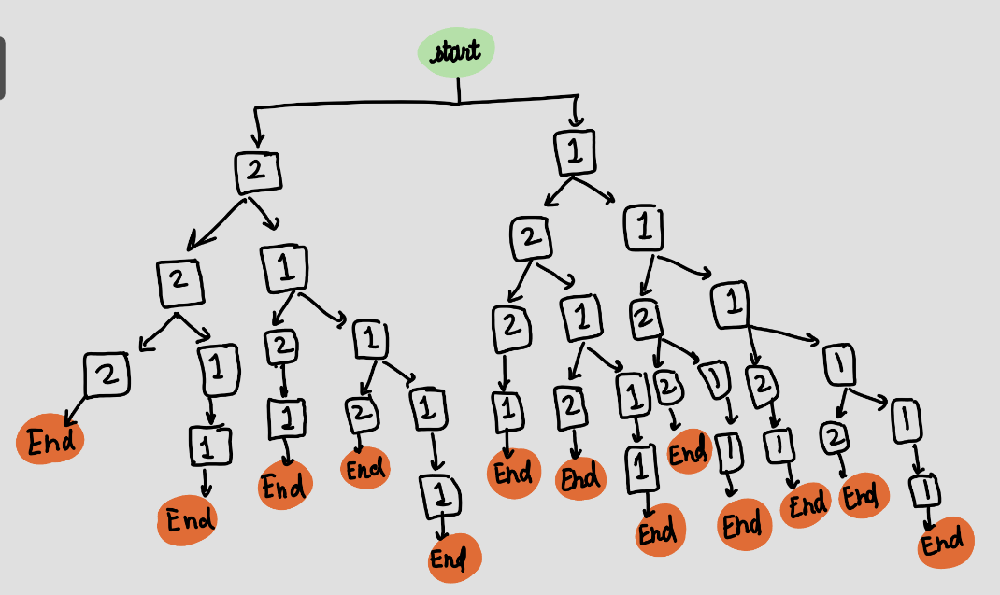
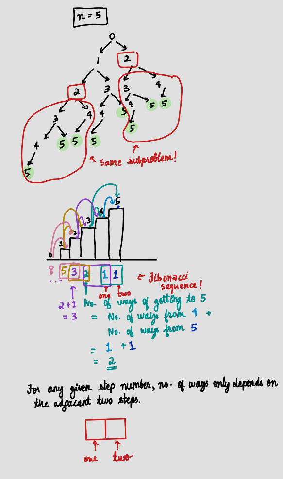

<h2><a href="https://leetcode.com/problems/climbing-stairs">Climbing Stairs</a></h2> <hr><p>You are climbing a staircase. It takes <code>n</code> steps to reach the top.</p>

<p>Each time you can either climb <code>1</code> or <code>2</code> steps. In how many distinct ways can you climb to the top?</p>

<p>&nbsp;</p>
<p><strong class="example">Example 1:</strong></p>

<pre>
<strong>Input:</strong> n = 2
<strong>Output:</strong> 2
<strong>Explanation:</strong> There are two ways to climb to the top.
1. 1 step + 1 step
2. 2 steps
</pre>

<p><strong class="example">Example 2:</strong></p>

<pre>
<strong>Input:</strong> n = 3
<strong>Output:</strong> 3
<strong>Explanation:</strong> There are three ways to climb to the top.
1. 1 step + 1 step + 1 step
2. 1 step + 2 steps
3. 2 steps + 1 step
</pre>

<p>&nbsp;</p>
<p><strong>Constraints:</strong></p>

<ul>
	<li><code>1 &lt;= n &lt;= 45</code></li>
</ul>


## Thought Process

- What approach did I first consider and why?
Initially, I thought of classifying the different "types" of ways of climbing up the stairs - and then adding the number of ways existing for each type. However, this quickly turned out to be inefficient. My next approach was to draw out an image for clarity.



---

## Approaches

---

### Approach 1: Dynamic Programming

#### Data Structures Used
Array

#### Algorithm
This question was my introduction to the concept of . With the help of , I was able to use the concept of memoization to solve this quickly and efficiently. 

At every given step, we have the choice of making either 1 step or 2 steps. At each given step, we also have a different number of ways to reach the result (more detailed explanation in the image). But we can quickly notice that there are several sub-problems that are being repeated - this means we can store solutions to subproblems so that each one is only solved once [the core idea of DP - caching the result or "memoization"]. 

We can also observe that the result of starting at 0 depends on the subproblem of 1, the subproblem of 1 depends on the subproblem of 2, and so on. So, we can start at the bottom and work our way up [Bottom Up DP Approach]!

#### Complexity Analysis
- Time Complexity: O(n)
- Space Complexity: O(1)

#### Diagrams or Notes


#### Code
```python
class Solution(object):
    def climbStairs(self, n):
        """
        :type n: int
        :rtype: int
        """
        one = 1
        two = 1
        
        for i in range(n-1):

            one = one + two
            two = one - two

        return one
        
```
---
## Final Remarks

- What did I learn from this problem?
Dynamic Programming! 
- Would I approach it differently now?
Yes, especially the way I do LeetCode - I think the key is to learn each algorithm really well, before moving on to the next type of problem.


