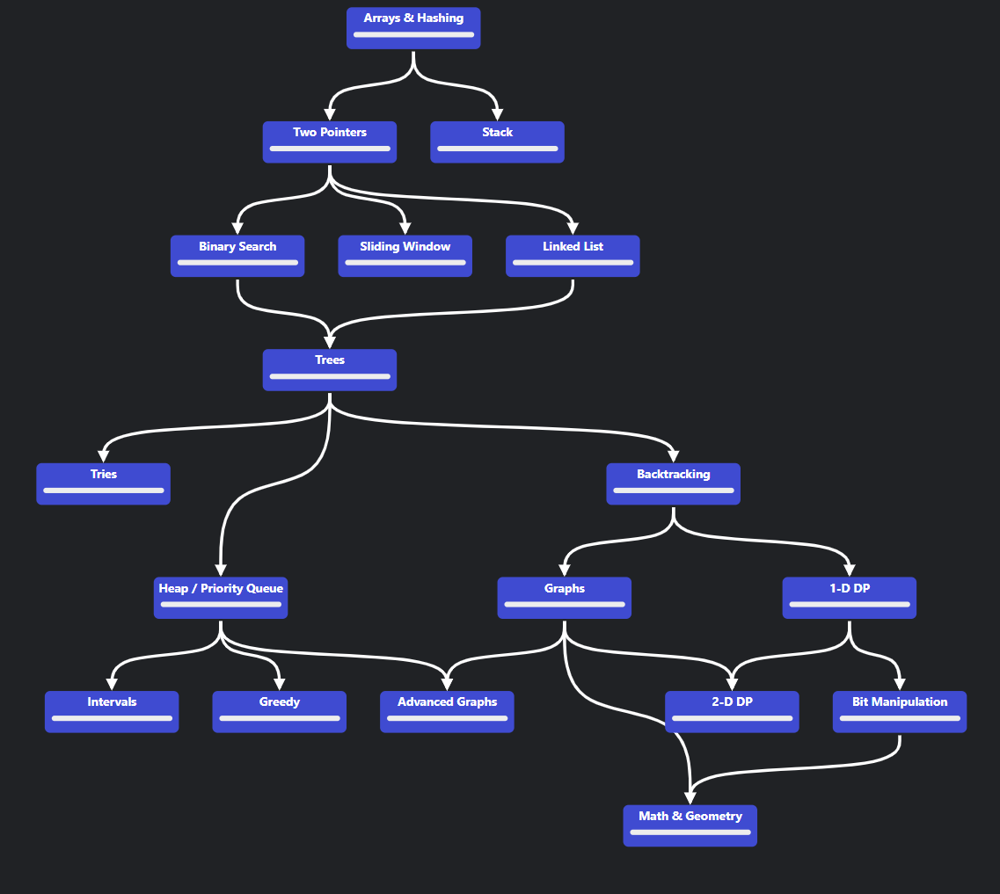

# My LeetCode Solutions & Lessons Repository

I love LeetCode. Probably because I don't do it for interviews (thankfully not a *cooked* CS major), but for the genuine satisfaction of working through logical challenges and learning algorithms.

That said, I have struggled with consistency and long-term retention. Early on, I would spend a lot of time understanding the algorithm behind a problem before writing any code. But when I revisited the same question a week later, I would often draw a complete blank.

This repository (especially making it Public!) is my attempt to fix that. Alongside my solutions, I aim to document my thought process, lessons learned, and improvements made.

## How I practice LeetCode problems

I don’t think there is a single “right way” to practice LeetCode, but this approach reflects what I have learned from YouTube videos and Reddit posts. I am using this space not just to organize my own thoughts after watching those resources, but also to break things down in a way that might help others who are trying to crack LeetCode themselves.

## Videos I watched [to figure out the "right way"]

1. [How to Use LeetCode Effectively by PIRATE KING](https://www.youtube.com/watch?v=IB_F10twtvY)

2. [The unfair way I got good at Leetcode](https://www.youtube.com/watch?v=GPIuPRqDGG8&t=76s)

3. [How I would learn Leetcode if I could start over](https://www.youtube.com/watch?v=aHZW7TuY_yo&t=747s)

4. [3 Months of Learning Leetcode](https://www.youtube.com/watch?v=wufc6w8fqvY)

5. [I'm an ex-Google interviewer. You're doing LeetCode wrong.](https://www.youtube.com/watch?v=Cq7eND5KSPk)

---

## Lessons I learned - A Step-by-Step Breakdown

1. **Pick a DSA Pattern to learn.**

Start with NeetCode's detailed roadmap and follow the order given:

Understand how the pattern works by watching videos by [William Fiset](https://www.youtube.com/@WilliamFiset-videos) and following up with an article from [Geeks for Geeks](https://www.geeksforgeeks.org/dsa-tutorial-learn-data-structures-and-algorithms/). 

2. **Search for problems with that pattern and look at the solution.**

Search up problems topic-wise. Some resources to help you do this are as follows:

- **[LeetCode Post - Topic wise problems for Beginners](https://leetcode.com/discuss/post/448024/topic-wise-problems-for-beginners-by-yas-tlx4/)**
- **[DSA Top 150 Leet Code Questions - Topic Wise](https://www.studocu.com/in/document/vivekanandha-college-of-technology-for-women/mathematics/dsa-top-150-leet-code-questions-topic-wise/39876637)**
- **[Grind 75](https://www.techinterviewhandbook.org/grind75/)**
- **[Top Interview 150](https://leetcode.com/studyplan/top-interview-150/)**
- Or just go to **[Blind 75](https://leetcode.com/problem-list/oizxjoit/)** or any other list and apply a filtered search for the topic you want to tackle.

Look at the solution for the question and understand how it works **deeply**.

3. **Repeat this for a few problems until you understand that pattern.**

Do the same for several questions until you are confident enough to tackle a similar problem on your own.

4. **Solve some problems on your own and implement each algorithm several times.**

Once you are confident, try solving some problems on your own. If you feel stuck, come back to the solution later and try it. If you still feel unsure, look at the solution, come back to it the next day, and solve it again.

5. **Repeat Steps 1 to 4 for each pattern.**

## General Tips & Motivation
