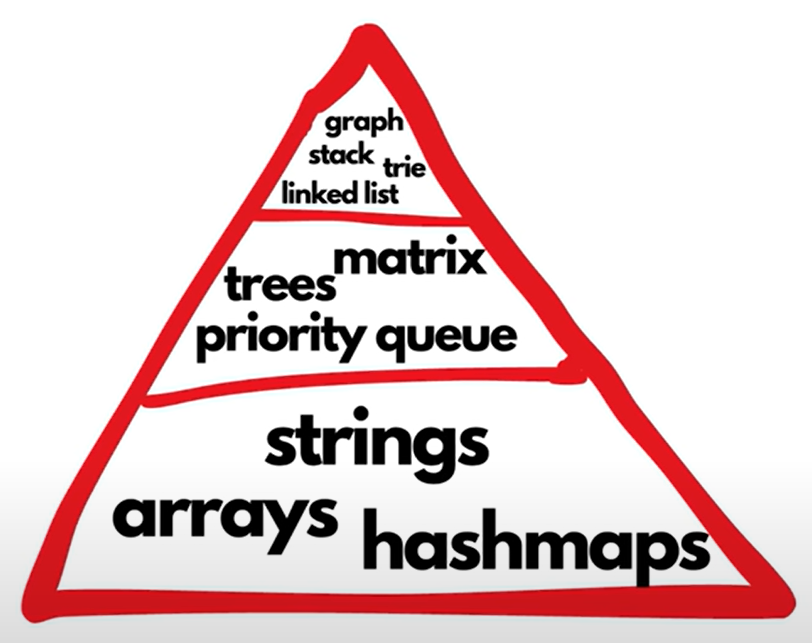

# My LeetCode Solutions & Lessons Repository

I love LeetCode. Probably because I don't do it for interviews (thankfully not a *cooked* CS major), but for the genuine satisfaction of working through logical challenges and learning algorithms.

That said, I have struggled with consistency and long-term retention. Early on, I would spend a lot of time understanding the algorithm behind a problem before writing any code. But when I revisited the same question a week later, I would often draw a complete blank.

This repository (especially making it Public!) is my attempt to fix that. Alongside my solutions, I aim to document my thought process, lessons learned, and improvements made.

---

## How I practice LeetCode problems

I don’t think there is a single “right way” to practice LeetCode, but this approach reflects what I have learned from YouTube videos and Reddit posts. I am using this space not just to organize my own thoughts after utilizing those resources, but also to break things down in a way that might help others who are trying to crack LeetCode themselves.

## Videos I watched [to figure out the "right way"]

1. ["How to Use LeetCode Effectively" by PIRATE KING](https://www.youtube.com/watch?v=IB_F10twtvY)

2. ["The unfair way I got good at Leetcode" by Dave Burji](https://www.youtube.com/watch?v=GPIuPRqDGG8&t=76s)

3. ["How I would learn Leetcode if I could start over" by NeetCodeIO](https://www.youtube.com/watch?v=aHZW7TuY_yo&t=747s)

4. ["3 Months of Learning Leetcode" by Garrett Codes](https://www.youtube.com/watch?v=wufc6w8fqvY)

5. ["I'm an ex-Google interviewer. You're doing LeetCode wrong." by Anthony D. Mays](https://www.youtube.com/watch?v=Cq7eND5KSPk)

## Lessons I learned - A Step-by-Step Breakdown

1. **Pick a DSA Pattern to learn.**

Start with NeetCode's detailed roadmap and follow the order given:

Understand how the pattern works by watching videos by [William Fiset](https://www.youtube.com/@WilliamFiset-videos) and following up with an article from [Geeks for Geeks](https://www.geeksforgeeks.org/dsa-tutorial-learn-data-structures-and-algorithms/). 

2. **Search for problems with that pattern and look at the solution.**

Search up problems topic-wise. Some resources to help you do this are as follows:

- **[LeetCode Post - Topic wise problems for Beginners](https://leetcode.com/discuss/post/448024/topic-wise-problems-for-beginners-by-yas-tlx4/)**
- **[DSA Top 150 Leet Code Questions - Topic Wise](https://www.studocu.com/in/document/vivekanandha-college-of-technology-for-women/mathematics/dsa-top-150-leet-code-questions-topic-wise/39876637)**
- **[Grind 75](https://www.techinterviewhandbook.org/grind75/)**
- **[Top Interview 150](https://leetcode.com/studyplan/top-interview-150/)**
- Or just go to **[Blind 75](https://leetcode.com/problem-list/oizxjoit/)** or any other list and apply a filtered search for the topic you want to tackle.

Look at the solution for the question and understand how it works **deeply**.

3. **Repeat this for a few problems until you understand that pattern.**

Do the same for several questions until you are confident enough to tackle a similar problem on your own. 

4. **Solve some problems on your own and implement each algorithm several times.**

Once you are confident, try solving some problems on your own. If you feel stuck, come back to the solution later and try it. If you still feel unsure, look at the solution, come back to it the next day, and solve it again. Don't sort the questions by order of Difficulty - sort them by order of Acceptance instead. This is because some Medium questions often tend to be easier than the Easy ones.

5. **Repeat Steps 1 to 4 for each pattern.**

Once you are able to recognize the problem well, go to the next pattern. Follow this "priority pyramid" to decide how much time to spend on each pattern.

Start at the bottom of the pyramid and work your way up. Spend at least 50% of your time understanding the bottom-most row.

6. **Randomize when you're solid with all the important DSAs.**

Once you are confident with all the essential DSAs, you can randomly choose a mix of easy, medium, and hard questions and focus on recognizing the pattern and implementing the algorithms well.

## General Tips & Motivation

This is more like a personal note to myself, but it's out there for anyone who needs this.

1. **Stop. The. Comparison. It's stupid.**

Seriously, get a hold of yourself. There is nothing more illogical than comparing yourself with other people. Some people start earlier than you do, others start later. Some have different strengths and weaknesses. Some had the advantages of some resources and experiences that you probably didn't have access to. 

Instead, direct that time and energy on improving yourself and levelling up. Always ask yourself: what can I do to improve the way I am learning?

2. **Repetition and Practice is necessary to learn anything.**

NeetCode explains this beautifully in his video.

3. **The "Why" is really important.**

LeetCode is not just about memorizing patterns and applying them. Learn how to be curious and ask more questions. Learn about Big O Complexity. Be comfortable with the uncertainty and the confusion. Learn to be patient and work through problems instead of running away every time you hit a roadblock or opening Instagram when you find a slightly difficult problem.

4. **Consistency is key. Perfection is secondary.**

Don't spend too much time trying to figure out "the perfect way" to practice LeetCode. Instead, focus on getting into the habit of LeetCoding regularly and consistently. Imperfect consistency triumphs sporadic perfection every single time. You'll figure it out anyway.
